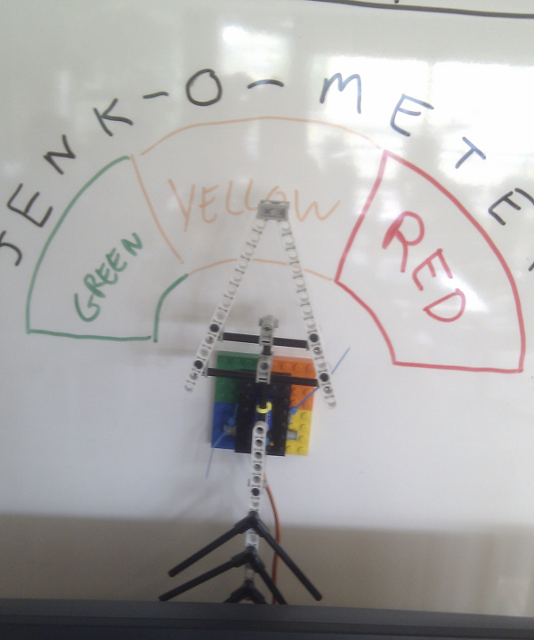

# Jenk-O-Meter

> This project was originally completed in May 2011.

Implements an [extreme feedback device](https://www.google.co.uk/search?q=extreme+feedback+device)" for our Jenkins build system in the office by providing to the team a visual representation of the overall health of a given Jenkins View.

It used developer friendly tools  (PHP and Lego) to create an attractive visible interface which highlighted build failures by simply moving and pointing to a changed overall stability.




## Arduio Code

Lost to the mysts of time, the arduino code that went with this would simply listen to serial.read waiting for an "API" request from the connected PC which would intruct on what position to rotate the connected Servo.

Three operations were supported where a request was submitted as a simple string request with a command byte, separator(;) and parameters (where needed)

1. PING - ```2;``` - Returned "pong"
2. GET - ```5;``` - Retrieved the current position of the servo
3. SET - ```4;[0-180]``` - Set the position of the servo in degrees between 0 and 180 with 90 being Neutral

The Arduio was connected to the servo via an extention cable made from an audio extention lead (as you only need three wires to control a servo this was an easy patch)

## Jenkins Code

Simply reads a given Jenkins view, obtains the Red, Yellow and Blue colours of builds and creates a weighted orientation (red builds are "heavier" so twist the gauge more), and then sends it over a serial connection to the connected arduio.

It gets run as a cron job, every five minutes.

